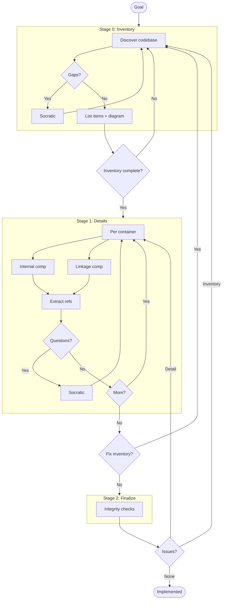
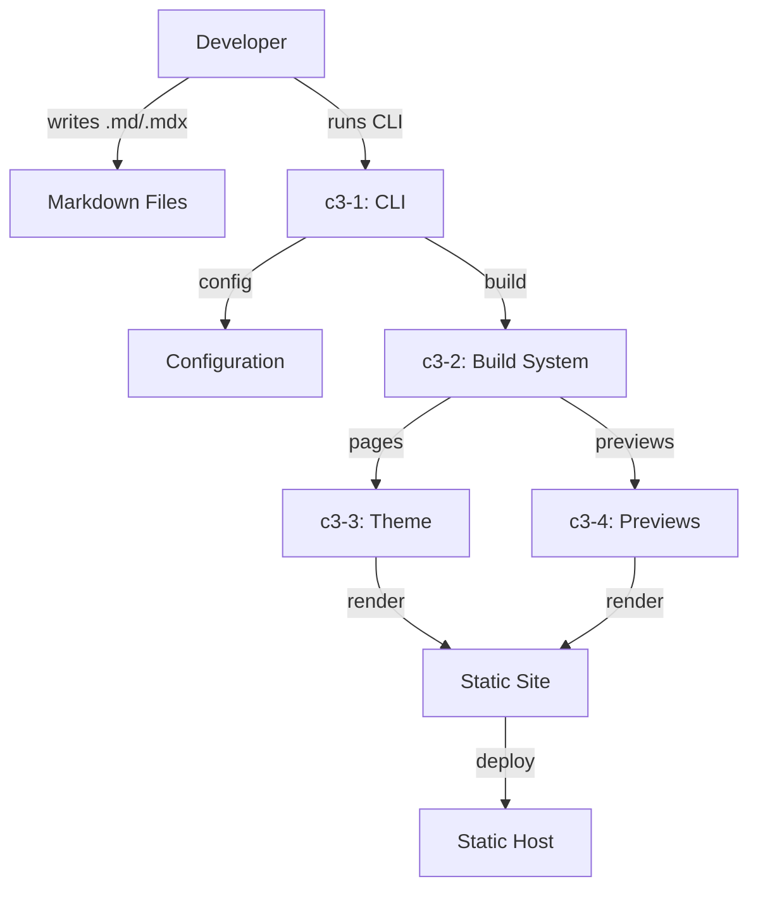

# C3 Architecture Documentation Adoption

## Goal

Adopt C3 methodology for prev-cli.

<!--
EXIT CRITERIA (all must be true to mark implemented):
- All containers documented with Goal Contribution
- All components documented with Container Connection
- Refs extracted for repeated patterns
- Integrity checks pass
- /c3 audit passes
-->

## Workflow

---

## Stage 0: Inventory

<!--
DISCOVER everything first. Don't document yet.
- Auto-discover codebase structure
- Use AskUserQuestion for gaps
- Identify refs that span across items
- Exit: All items listed with arguments for templates
-->

### Context Discovery

| Arg | Value |
|-----|-------|
| PROJECT | prev-cli |
| GOAL | Transform MDX directories into beautiful documentation websites with zero configuration |
| SUMMARY | A CLI tool that generates interactive documentation sites from markdown/MDX files with built-in preview system |

### Container Discovery

| N | CONTAINER_NAME | GOAL | SUMMARY |
|---|----------------|------|---------|
| 1 | cli | Parse CLI commands, load configuration, validate setup | CLI entry point and configuration management |
| 2 | build | Orchestrate Bun.build with server plugins | Build system with Bun.build/Bun.serve |
| 3 | theme | Render documentation UI with React | Frontend theme and UI components |
| 4 | previews | Provide interactive component catalog | Preview system for components, screens, flows |
| 5 | jsx | Define renderer-agnostic layout primitives | JSX-based layout system (WIP) |
| 6 | primitives | Template-based layout primitives | Legacy template system (WIP) |
| 7 | tokens | Design token system with shadcn defaults and user overrides | Token resolution, defaults, validation |

### Component Discovery (Brief)

| N | NN | COMPONENT_NAME | CATEGORY | GOAL | SUMMARY |
|---|----|--------------  |----------|------|---------|
| 1 | 101 | cli-entry | foundation | Parse CLI arguments and route to commands | CLI argument parsing and command dispatch |
| 1 | 102 | config-loader | foundation | Load and merge configuration from files | Configuration loading and validation |
| 1 | 103 | validator | foundation | Validate project structure and config | Project structure validation |
| 1 | 104 | typechecker | feature | Embedded TypeScript checking | Type checking integration |
| 2 | 202 | pages-plugin | feature | Generate pages from MDX files | MDX page generation |
| 2 | 203 | previews-plugin | feature | Generate preview routes | Preview route generation |
| 2 | 205 | config-plugin | foundation | Inject config into runtime | Config injection |
| 2 | 206 | mdx-plugin | foundation | Process MDX with plugins | MDX processing |
| 2 | 207 | preview-runtime | feature | Runtime support for previews | Preview runtime components |
| 2 | 208 | tokens-plugin | foundation | Serve design tokens as virtual module and HTTP endpoint | Tokens delivery |
| 2 | 209 | dev-server | foundation | Bun.serve dev server with SSE reload | Dev server |
| 2 | 210 | build | foundation | Production static site generation via Bun.build | Production build |
| 2 | 211 | preview-server | foundation | Static file serving for built sites | Preview server |
| 2 | 212 | aliases-plugin | foundation | React dedup and package resolution | Alias resolution |
| 3 | 301 | entry | foundation | React application entry | Theme entry point |
| 3 | 302 | layout | foundation | Page layout structure | Layout components |
| 3 | 303 | mdx-provider | foundation | MDX component mapping | MDX provider setup |
| 3 | 304 | toolbar | feature | Navigation toolbar | Toolbar UI component |
| 3 | 305 | sidebar | feature | Documentation sidebar | Sidebar navigation |
| 4 | 401 | preview-router | foundation | Route previews by type | Preview routing logic |
| 4 | 402 | component-viewer | feature | Display component previews | Component preview viewer |
| 4 | 403 | screen-viewer | feature | Display screen previews | Screen preview viewer |
| 4 | 404 | flow-viewer | feature | Display flow previews | Flow preview viewer |
| 4 | 406 | render-adapter | foundation | Adapt renderers for previews | Renderer adaptation |
| 5 | 501 | vnode | foundation | Virtual node representation | VNode structure |
| 5 | 502 | jsx-runtime | foundation | JSX transformation runtime | JSX runtime |
| 5 | 503 | define-component | feature | Component definition API | Component definition |
| 5 | 504 | html-adapter | foundation | HTML rendering adapter | HTML adapter |
| 6 | 601 | types | foundation | Primitive type definitions | Type definitions |
| 6 | 602 | parser | foundation | Parse primitive templates | Template parser |
| 6 | 603 | template-parser | foundation | Parse template syntax | Template syntax parser |
| 6 | 604 | template-renderer | foundation | Render templates to output | Template renderer |
| 7 | 701 | resolver | foundation | Resolve token config from YAML + defaults | Token resolution |
| 7 | 702 | defaults | foundation | Default shadcn design token values | Token defaults |
| 7 | 703 | validation | foundation | Validate token references with suggestions | Token validation |

### Ref Discovery

| SLUG | TITLE | GOAL | Applies To |
|------|-------|------|------------|
| config-schema | Configuration Schema | Define configuration structure and validation | cli, build |
| preview-types | Preview Types | Define type system for previews | previews, build |
| theming | Theming System | Define theme and styling patterns | theme |
| virtual-modules | Virtual Modules | Define virtual module patterns | build |

### Overview Diagram

### Gate 0

- [x] Context args filled
- [x] All containers identified with args
- [x] All components identified (brief) with args
- [x] Cross-cutting refs identified
- [x] Overview diagram generated

---

## Stage 1: Details

<!--
Fill in each container with its components.
- Internal: components that are self-contained
- Linkage: components that handle connections to other containers
- Extract refs when patterns repeat
- If new item found → back to Stage 0
-->

### Container: c3-1-cli

**Created:** [x] `.c3/c3-1-cli/README.md`

| Type | Component ID | Name | Category | Doc Created |
|------|--------------|------|----------|-------------|
| Internal | c3-101 | cli-entry | foundation | [x] |
| Internal | c3-102 | config-loader | foundation | [x] |
| Internal | c3-103 | validator | foundation | [x] |
| Internal | c3-104 | typechecker | feature | [x] |

### Container: c3-2-build

**Created:** [x] `.c3/c3-2-build/README.md`

| Type | Component ID | Name | Category | Doc Created |
|------|--------------|------|----------|-------------|
| Internal | c3-202 | pages-plugin | feature | [x] |
| Internal | c3-203 | previews-plugin | feature | [x] |
| Internal | c3-205 | config-plugin | foundation | [x] |
| Internal | c3-206 | mdx-plugin | foundation | [x] |
| Internal | c3-207 | preview-runtime | feature | [x] |
| Internal | c3-208 | tokens-plugin | foundation | [x] |
| Internal | c3-209 | dev-server | foundation | [x] |
| Internal | c3-210 | build | foundation | [x] |
| Internal | c3-211 | preview-server | foundation | [x] |
| Internal | c3-212 | aliases-plugin | foundation | [x] |

### Container: c3-3-theme

**Created:** [x] `.c3/c3-3-theme/README.md`

| Type | Component ID | Name | Category | Doc Created |
|------|--------------|------|----------|-------------|
| Internal | c3-301 | entry | foundation | [x] |
| Internal | c3-302 | layout | foundation | [x] |
| Internal | c3-303 | mdx-provider | foundation | [x] |
| Internal | c3-304 | toolbar | feature | [x] |
| Internal | c3-305 | sidebar | feature | [x] |

### Container: c3-4-previews

**Created:** [x] `.c3/c3-4-previews/README.md`

| Type | Component ID | Name | Category | Doc Created |
|------|--------------|------|----------|-------------|
| Internal | c3-401 | preview-router | foundation | [x] |
| Internal | c3-402 | component-viewer | feature | [x] |
| Internal | c3-403 | screen-viewer | feature | [x] |
| Internal | c3-404 | flow-viewer | feature | [x] |
| Internal | c3-406 | render-adapter | foundation | [x] |

### Container: c3-5-jsx

**Created:** [x] `.c3/c3-5-jsx/README.md`

| Type | Component ID | Name | Category | Doc Created |
|------|--------------|------|----------|-------------|
| Internal | c3-501 | vnode | foundation | [x] |
| Internal | c3-502 | jsx-runtime | foundation | [x] |
| Internal | c3-503 | define-component | feature | [x] |
| Internal | c3-504 | html-adapter | foundation | [x] |

### Container: c3-6-primitives

**Created:** [x] `.c3/c3-6-primitives/README.md`

| Type | Component ID | Name | Category | Doc Created |
|------|--------------|------|----------|-------------|
| Internal | c3-601 | types | foundation | [x] |
| Internal | c3-602 | parser | foundation | [x] |
| Internal | c3-603 | template-parser | foundation | [x] |
| Internal | c3-604 | template-renderer | foundation | [x] |

### Container: c3-7-tokens

**Created:** [x] `.c3/c3-7-tokens/README.md`

| Type | Component ID | Name | Category | Doc Created |
|------|--------------|------|----------|-------------|
| Internal | c3-701 | resolver | foundation | [x] |
| Internal | c3-702 | defaults | foundation | [x] |
| Internal | c3-703 | validation | foundation | [x] |

### Refs Created

| Ref ID | Pattern | Doc Created |
|--------|---------|-------------|
| ref-config-schema | Configuration Schema | [x] |
| ref-preview-types | Preview Types | [x] |
| ref-theming | Theming System | [x] |
| ref-virtual-modules | Virtual Modules | [x] |

### Gate 1

- [x] All container README.md created
- [x] All component docs created
- [x] All refs documented
- [x] No new items discovered (else → Gate 0)

---

## Stage 2: Finalize

<!--
Integrity checks - verify everything connects.
If issues found → back to appropriate stage.
-->

### Integrity Checks

| Check | Status |
|-------|--------|
| Context ↔ Container (all containers listed in c3-0) | [x] |
| Container ↔ Component (all components listed in container README) | [x] |
| Component ↔ Component (linkages documented) | [x] |
| * ↔ Refs (refs cited correctly, Cited By updated) | [x] |

### Gate 2

- [x] All integrity checks pass
- [x] `/c3 audit` passes

---

## Conflict Resolution

If later stage reveals earlier errors:

| Conflict | Found In | Affects | Resolution |
|----------|----------|---------|------------|
| None | - | - | - |

---

## Exit

When Gate 2 complete → change frontmatter status to `implemented`

## Audit Record

| Phase | Date | Notes |
|-------|------|-------|
| Adopted | 2026-01-30 | Initial C3 structure created with 6 containers, 26 components, 4 refs |
| Completed | 2026-01-30 | Added ADR-000 and TOC.md to complete onboarding |
| Audited | 2026-02-27 | Added c3-7-tokens (3 components), c3-208-tokens-plugin; fixed c3-406 API accuracy |
